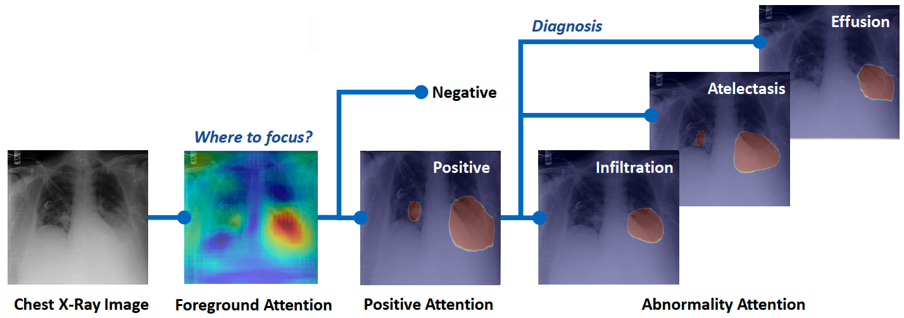

# Hierarchical Attention Mining (HAM) for weakly-supervised abnormality localization 

This is the official PyTorch implementation for the HAM method.

[Paper](https://arxiv.org/abs/2112.12349) | [Model](#model) | [Data](#data)

**Learning hierarchical attention for weakly-supervised chest X-ray abnormality localization and diagnosis**<br>
by **Xi Ouyang**, Srikrishna Karanam, Ziyan Wu, Terrence Chen, Jiayu Huo, Xiang Sean Zhou, Qian Wang, Jie-Zhi Cheng<br>



## Abstract
We propose a new attention-driven weakly supervised algorithm comprising a hierarchical attention mining framework that unifies activation- and gradient-based visual attention in a holistic manner. On two largescale chest X-ray datasets ([NIH Chest X-ray14](https://nihcc.app.box.com/v/ChestXray-NIHCC) and [CheXpert](https://stanfordmlgroup.github.io/competitions/chexpert/)), it can achieve significant localization performance improvements over the current state of the art while also achieve competitive classification performance.

## Release Notes
This repository is a faithful reimplementation of HAM in PyTorch, including all the training and evaluation codes on NIH Chest X-ray14 dataset. We also provide two trained models for this dataset. For CheXpert dataset, you can refer to the data preparation on NIH Chest X-ray14 dataset to implement the code. 

Since images in CheXpert are annotated with labels only at image
level, we invite a senior radiologist with 10+ years of experience to label the bounding boxes for 9 abnormalities. These annotations are also opensourced [here](#data), including 6099 bounding boxes for 2345 images. We hope that it can help the future researchers to better verify their methods.

## Installation
Clone this repo.
```bash
git clone https://github.com/oyxhust/HAM.git
cd HAM/
```
We provide the CRF method in this code, which can help to refine the box annotations to close to the mask. It is not activated by default, but `pydensecrf` should be installed. 
```bash
pip install cython
pip install git+https://github.com/lucasb-eyer/pydensecrf.git
```
This code requires PyTorch 1.1+ and python 3+. Please install Pytorch 1.1+ environment, and install dependencies (e.g., torchvision, visdom and PIL) by
```bash
pip install -r requirements.txt
```

## Dataset Preparation
For NIH Chest X-ray14 or CheXpert, the datasets must be downloaded beforehand. Please download them on the respective webpages. In the case of NIH Chest X-ray14, we put a few sample images in this code repo.

**Preparing NIH Chest X-ray14 Dataset**. The dataset can be downloaded [here](https://nihcc.app.box.com/v/ChestXray-NIHCC) (also could be downloaded from [Kaggle Challenge](https://www.kaggle.com/nih-chest-xrays/data)). In particular, you will need to download “images_001.tar.gz", “images_002.tar.gz", ..., and "images_012.tar.gz". All these files will be decompressed into a `images` folder. The images and labels should be arranged in the same directory structure as `datasets/NIHChestXray14/`. The folder structure should be as follows:
```
├── datasets
│   ├── NIHChestXray14
│   │    ├── images
│   │    │    ├── 00000001_000.png
│   │    │    ├── 00000001_001.png
│   │    │    ├── 00000001_002.png
│   │    │    ├── ...
│   │    ├── Annotations
│   │    │    ├── BBoxes.json
│   │    │    └── Tags.json
│   │    ├── ImageSets
│   │    │    ├── bbox
│   │    │    └── Main
```
`BBoxes.json` is a dictionary to store the bounding boxes for abnormality localization in this dataset. `Tags.json` is a dictionary of the image-level labels for all the images. These json files are generated from the original dataset files for better input to our models. `ImageSets` contains data split files of the training, validation and testing in different settings. 

**Preparing CheXpert Dataset**.<span id="data"></span> The dataset can be downloaded [here](https://stanfordmlgroup.github.io/competitions/chexpert/). You can follow the similar folder structure of NIH Chest X-ray14 dataset to prepare this dataset. Since images in CheXpert are annotated with labels only at image level, we invite a senior radiologist with 10+ years of experience to label the bounding boxes for 9 abnormalities. We release these localization annotations in `datasets/CheXpert/Annotations/BBoxes.json`. It is a dictionary with the relative image path under `CheXpert/images` fold as the key, and store the corresponding abnormality box annotations. For each bounding box, the coordinate format is `[xmin, ymin, xmax, ymax]`. We have labeled 6099 bounding boxes for 2345 images. It is worth noting that the number of our box annotations
is significantly larger than the number of annotated boxes in
the NIH dataset. Hope to better help future researchers.

## Training
### Visdom
We use visdom to plot the loss values and the training attention results. Therefore, it is neccesary to open a visdom port during training. Open a terminal in any folder and input:
```bash
python -m visdom.server
```
Click the URL http://localhost:8097 to see the visualization results. Here, it uses the default port 8097.

Also, you can choose to use other ports by
```bash
python -m visdom.server -p 10004
```
10004 is an example, which can be set into any other available port of your machine. The port number "display_port" in the corresponding config file should be also set into the same value, and click the URL http://localhost:10004 to see the visualization results. 

### Classification Experiments
Train a model on the official split of NIH Chest-Xray14 dataset:
```bash
python train.py -cfg configs/NIHChestXray14/classification/official_split.yaml
```
The training log and visualization results will be stored on `output/logs` and `output/train` respectively. Our trained models on offical splits is avaliable on [Baidu Yun](https://pan.baidu.com/s/1SvHnsUqlrl7IG3svJEFRZQ) (code: rhsd) or [Google Drive](https://drive.google.com/file/d/17qWMq246dQ249wHotdceOK4Ayrb1YWyU/view?usp=sharing).

Train the models on 5-fold cross-validation (CV) scheme of NIH Chest-Xray14 dataset. In each fold, we use 70% of the annotated and 70% of unannotated images for training, and 10% of the annotated and unannotated images for validation. Then, the rest 20% of the annotated and unannotated images are used for testing. Train on fold1:
```bash
python train.py -cfg configs/NIHChestXray14/classification/5fold_validation/fold1.yaml
```
Config files of other folds can be also found on `configs/NIHChestXray14/classification/5fold_validation`.

### Localization Experiments
Train our model with 100% images (111,240) without any box annotations and test with the 880 images with box annotations on NIH Chest-Xray14 dataset:
```bash
python train.py -cfg configs/NIHChestXray14/localization/without_bboxes.yaml
```

Train the models on 5-fold cross-validation (CV) scheme of NIH Chest-Xray14 dataset. In each fold, we train our model with 50% of the unannotated images and 80% of the annotated images, and tested with the remaining 20% of the annotated images. Train on fold1:
```bash
python train.py -cfg configs/NIHChestXray14/localization/5fold_validation/fold1.yaml
```
Trained models on fold1 is avaliable on [Baidu Yun](https://pan.baidu.com/s/1M4eJV4kkrm1E8ql4b9_clQ) (code: c7np) or [Google Drive](https://drive.google.com/file/d/1zB9EC712hoOYlm7TJXsEbqFPiWGsZKdd/view?usp=sharing). Config files of other folds can be also found on `configs/NIHChestXray14/localization/5fold_validation`.

## Testing <span id="model"></span>
Here, we take the test results for the official splits of NIH Chest-Xray14 dataset as an example. It requires the corresponding config file and the trained weights. Please download the trained model on [Baidu Yun](https://pan.baidu.com/s/1SvHnsUqlrl7IG3svJEFRZQ) (code: rhsd) or [Google Drive](https://drive.google.com/file/d/17qWMq246dQ249wHotdceOK4Ayrb1YWyU/view?usp=sharing).

Once get the trained model, the test results (classification and localization metrics) can be calculated by:
```bash
python test.py -cfg configs/official_split.yaml -w [PATH/TO/OfficialSplit_Model.pt]
```

Also, the attention maps from our method can be generated by:
```bash
python visual.py -cfg configs/official_split.yaml -w [PATH/TO/OfficialSplit_Model.pt]
```
The attention results will be saved in `outputs/visual`. You can open the `index.html` to check all the results in a webpage.

Also, you can download the model trained with box annotations on [Baidu Yun](https://pan.baidu.com/s/1M4eJV4kkrm1E8ql4b9_clQ) (code: c7np) or [Google Drive](https://drive.google.com/file/d/1zB9EC712hoOYlm7TJXsEbqFPiWGsZKdd/view?usp=sharing). This model can achieve much better localization results than the model trained on official split.


## Code Structure
- `train.py`, `test.py`, `visual.py`: the entry point for training, testing, and visualization.
- `configs/`: config files for training and testing.
- `data/`: the data loader.
- `models/`: creates the networks.
- `modules/attentions/`: the proposed foreground attention module.
- `modules/sync_batchnorm/`: the synchronized batchNorm.
- `utils/`: define the training, testing and visualization process and the support modules.
  
## Options
**Options in config files**. "GPUs" can select the gpus. "Means" and "Stds" are used for the normalization. "arch" only supports the resnet structure, you can choose one from `['ResNet', 'resnet18', 'resnet34', 'resnet50', 'resnet101','resnet152', 'resnext50_32x4d', 'resnext101_32x8d']`. "Downsampling" defines the downsampline rate of the feature map from the backbone, including `[8, 16, 32]`. "Using_pooling" decides whether to use the first pooling layer in resnet. "Using_dilation" decides whether to use the dilation convolution in resnet. "Using_pretrained_weights" decides whether to use the pretrained weights on ImageNet. "Using_CRF" decides whether to use the CRF to prepocess the input box annotations. It can help to refine the box to more close to the mask annotations. "img_size" and "in_channels" is the size and channel of the input image. "display_port" is the visdom port.

**Options in `utils/config.py`**. "model_savepath" is the path to save checkpoint. "outputs_path" is the path to save output results. "cam_w" and "cam_sigma" are the hyperparameters in the soft masking fuction in "refine_cams" function in `models/AttentionModel/resnet.py`. "cam_loss_sigma" is the hyperparameter for the soft masking in the abnormality attention map. "lse_r" is the hyperparameter for LSE pooling. "loss_ano", "loss_cls", "loss_ex_cls", "loss_bound", and "loss_union" are the weights for the weighting factors for different losses. "cls_thresh" is the threshold for classification prediction to calculate the accuracy. "cam_thresh" is the threshold for localization prediction to get the binary mask. "thresh_TIOU" and "thresh_TIOR" are the thresholds to calculate the TIoU and TIoR. "palette" defines the color for mask visualization.

## Citation
If you use this code or our published annotations of CheXpert dataset for your research, please cite our paper.
```
@article{ouyang2021learning,
  title={Learning hierarchical attention for weakly-supervised chest X-ray abnormality localization and diagnosis},
  author={Ouyang, Xi and Karanam, Srikrishna and Wu, Ziyan and Chen, Terrence and Huo, Jiayu and Zhou, Xiang Sean and Wang, Qian and Cheng, Jie-Zhi},
  journal={IEEE Transactions on Medical Imaging},
  volume={40},
  number={10},
  pages={2698--2710},
  year={2021},
  publisher={IEEE}
}
```

## Acknowledgments
We thank Jiayuan Mao for his [Synchronized Batch Normalization code](https://github.com/vacancy/Synchronized-BatchNorm-PyTorch), and Jun-Yan Zhu for his [HTML visualization code](https://github.com/junyanz/pytorch-CycleGAN-and-pix2pix).